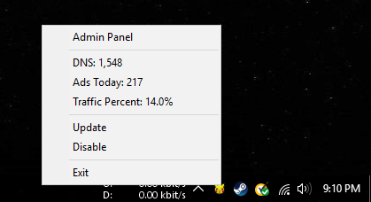

# Copernicus

[Copernicus](https://en.wikipedia.org/wiki/Orbiting_Astronomical_Observatory) aims to be a light weight windows desktop client for the [Pi-Hole](https://github.com/pi-hole/pi-hole) advertising-aware DNS/web server. As a simple tray application, it should be able to view the current stats, and also allow for a simple click to open the Pi-Hole admin panel. This project was created to learn how to create a simple application using the windows apis.

## Goals

* Allow for viewing of stats in tray menu
* Allow for enable/disable stat pulling
* Simple one click to get to the dashboard
* Easy installer for end user

## Dependencies

Right now the only dependency is ensuring that the MinGW with compiler is installed. You must be on a windows system to build, and this is a windows only program. Open an issue if you have trouble building the project.

* Install MSYS2 x86_64 from https://msys2.github.io/
* Add `C:\msys64\mingw64\bin` and `C:\msys64\usr\bin` to `PATH`
* Restart all editors to load new environmental variables

## Screenshots

